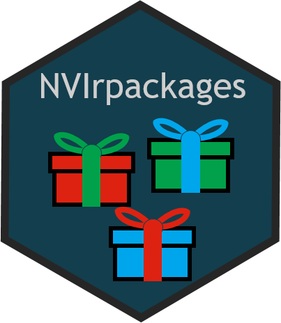

# NVIrpackages: Keeps a Table of the R packages in NVIverse 

<!-- README.md is generated from README.Rmd. Please edit that file -->

-   [Overview](#overview)
-   [Installation](#installation)
-   [Usage](#usage)
-   [Copyright and license](#copyright-and-license)
-   [Contributing](#contributing)

## Overview

`NVIrpackages`keeps a table of the R packages in `NVIverse`. The table
includes also meta data for the packages. The information is used in all
NVIverse packages when generating vignettes and in the package
‘NVIbatch’ in functions that use a list of NVIverse packages. This table
is kept in a separate package to avoid circular dependencies between
packages within NVIverse.

`NVIrpackages` is part of `NVIverse`, a collection of R-packages with
tools to facilitate data management and data reporting at the Norwegian
Veterinary Institute (NVI). The `NVIverse` consists of the following
packages: `NVIconfig`, `NVIdb`, `NVIpjsr`, `NVIspatial`, `NVIpretty`,
`NVIbatch`, `OKplan`, `OKcheck`, `NVIcheckmate`, `NVIpackager`,
`NVIrpackages`. See [Contribute to
NVIrpackages](https://github.com/NorwegianVeterinaryInstitute/NVIrpackages/blob/main/CONTRIBUTING.md)
for more information.

## Installation

`NVIrpackages` is available at
[GitHub](https://github.com/NorwegianVeterinaryInstitute). To install
`NVIrpackages` you will need:

-   R version &gt; 4.0.0
-   R package `remotes`
-   Rtools version 4.0, 4.2 or 4.3 depending on R version

First install and attach the `remotes` package.

    install.packages("remotes")
    library(remotes)

To install (or update) the `NVIrpackages` package without vignettes, run
the following code:

    remotes::install_github("NorwegianVeterinaryInstitute/NVIrpackages",
        upgrade = FALSE,
        build = TRUE,
        build_vignettes = FALSE)

To install (or update) the `NVIrpackages` package with vignettes, you
will need to first install some additional R-packages needed for
creating the vignettes. Check README below in the section
[Vignettes](#vignettes) to see which vignettes are available. To install
the package with the vignettes, first install the packages: `knitr`,
`rmarkdown`, `R.rsp`, and `NVIrpackages` (from GitHub) if they are
missing. Then run the following code:

    remotes::install_github("NorwegianVeterinaryInstitute/NVIrpackages",
        upgrade = FALSE,
        build = TRUE,
        build_vignettes = TRUE)

## Usage

The `NVIrpackages` package needs to be attached.

    library(NVIrpackages)

`NVIrpackages` keeps a table of the R packages in `NVIverse`. The table
includes also meta data for the packages. The information is used in all
NVIverse packages when generating vignettes and in the package
‘NVIbatch’ in functions that use a list of NVIverse packages. This table
is kept in a separate package to avoid circular dependencies between
packages within NVIverse.

In addition, the package include the hexagon sticker logos for the
packages were these have been created. When a logo has been created or
updated, use `NVIpackager::update_logo` to include the logo in the
package. Thereafter, you must update the README-file with
`NVIpackager::document_NVIpkg` with the argument `readme = TRUE`.

#### Further documentation

##### Help

The full list of all available functions and datasets can be accessed by
typing

    help(package = "NVIrpackages")

##### Vignettes

Consult the vignettes for task-oriented help.

    vignette(package = "NVIrpackages")

Vignettes in package `NVIrpackages`:

-   Contribute to NVIrpackages (html)

##### NEWS

Please check the
[NEWS](https://github.com/NorwegianVeterinaryInstitute/NVIrpackages/blob/main/NEWS)
for information on new features, bug fixes and other changes.

## Copyright and license

Copyright (c) 2022 - 2024 Norwegian Veterinary Institute.  
Licensed under the BSD\_3\_clause License. See
[License](https://github.com/NorwegianVeterinaryInstitute/NVIrpackages/blob/main/LICENSE)
for details.

## Contributing

Contributions to develop `NVIrpackages` is highly appreciated. There are
several ways you can contribute to this project: ask a question, propose
an idea, report a bug, improve the documentation, or contribute code.
See [Contribute to
NVIrpackages](https://github.com/NorwegianVeterinaryInstitute/NVIrpackages/blob/main/CONTRIBUTING.md)
for more information.

------------------------------------------------------------------------

<!-- Code of conduct -->

Please note that the NVIrpackages project is released with a
[Contributor Code of
Conduct](https://github.com/NorwegianVeterinaryInstitute/NVIrpackages/blob/main/CODE_OF_CONDUCT.md).
By contributing to this project, you agree to abide by its terms.
